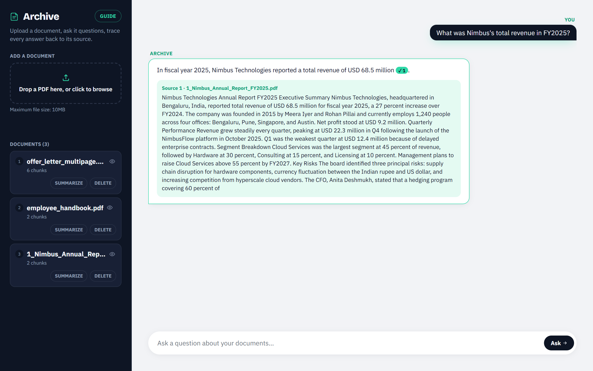
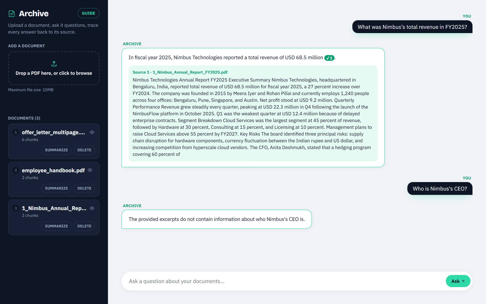
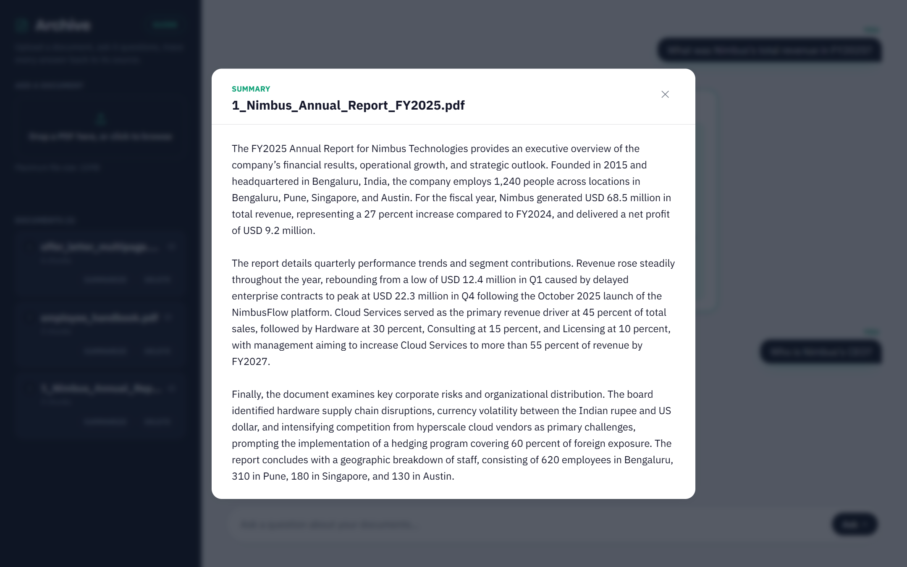
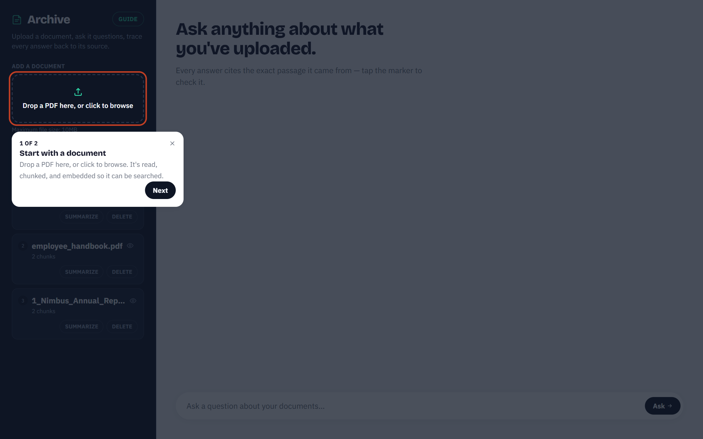
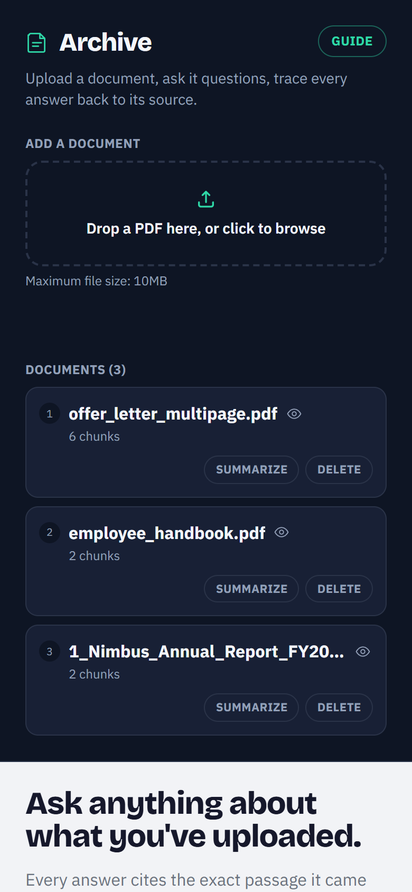
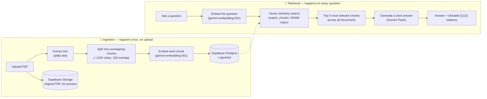

# Archive

**Archive** is a Retrieval-Augmented Generation (RAG) document Q&A app. Upload
a PDF, ask it questions in plain English, and get answers grounded strictly
in that document's content — every claim traceable back to the exact passage
it came from via clickable citations. No hallucinated answers, no guessing:
if the document doesn't contain the answer, the model says so.

**🔗 Live demo:** https://doc-qa-rag-black.vercel.app
**📦 Source:** https://github.com/parimala-06/RAG_DocQA



This project was built to get real, hands-on depth with the full RAG
pattern end-to-end — not just wiring an API call, but the whole pipeline:
chunking strategy, embedding generation, vector similarity search, and
prompt-grounded generation, plus the operational realities that only show up
once something is actually deployed (PDF parsing quirks, model
deprecations, vector index tuning, serverless bundling gotchas). Every issue
documented in the Engineering Notes section below was found by actually
running the app and fixing what broke, not written once and assumed
correct — the outcome is a fully working, deployed, end-to-end RAG
application with real debugging experience across the whole stack.

---

## Screenshots

**Grounded answers, with proof.** Every claim carries a numbered citation
marker; clicking it expands the exact passage the answer was drawn from.
(Shown above.)

**Honest when the document doesn't say.** Asked something the uploaded
documents don't contain, it says so instead of guessing.



**Summarize a whole document.** One click reassembles the document from its
chunks and produces a plain-prose summary.



**Guided tour for first-time visitors.** A two-step walkthrough highlights
where to upload and where to ask; the **Guide** button replays it any time.



**Responsive.** The document index stacks above the conversation on small
screens.



---

## Tech stack

| Layer | Technology | Why |
|---|---|---|
| Frontend + API | **Next.js 14** (App Router), React, Tailwind CSS | Single deployable app — UI and backend API routes in one codebase |
| Vector database | **Supabase** (Postgres + `pgvector` extension) | Native vector similarity search inside Postgres, no separate vector DB to run |
| File storage | **Supabase Storage** | Holds the original uploaded PDFs for the preview feature |
| Embeddings | **Gemini `gemini-embedding-001`** (768 dimensions) | Text embeddings from Google's GenAI API |
| Answer generation | **Gemini `gemini-flash-latest`**, with automatic fallback to `gemini-flash-lite-latest` | Fast generation; the fallback model has an independently-tracked usage quota, so exhausting one doesn't stop the app |
| PDF parsing | **pdfjs-dist** (Mozilla's PDF.js, used directly) | Extracts text from real-world PDFs, including ones with malformed structure |
| Hosting | **Vercel** | Zero-config deploys from GitHub, connected to this repo for continuous deployment |

---

## How the RAG pipeline works

RAG (Retrieval-Augmented Generation) means the model never answers "from
memory" — it's handed the actual relevant text from your document at
question time, and instructed to answer only from that. This is the same
architecture pattern used in production RAG systems, just at portfolio scale.



1. **Ingestion (upload)** — the PDF's text is extracted, split into
   overlapping chunks (so a fact that spans a chunk boundary doesn't get cut
   in half), and each chunk is converted into a 768-dimension vector
   embedding. Chunks and vectors are stored in Postgres; the original PDF is
   stored in Supabase Storage for later preview.
2. **Retrieval (ask)** — your question is embedded with the same model, and
   Postgres runs a cosine-similarity search (`<=>` operator, HNSW index) to
   find the 5 chunks — across *all* uploaded documents — most relevant to
   the question.
3. **Generation (answer)** — those 5 chunks are handed to Gemini in a prompt
   that explicitly instructs it to answer *only* from the excerpts, say so
   plainly if they don't contain the answer, and cite which excerpt(s) it
   used inline as `[1]`, `[2]`. The UI turns those into clickable markers
   that expand to show the exact source text.

### Document management

Beyond ask-a-question, the left panel gives you a small toolkit per document:

- **List** — every document ever ingested (fetched from Supabase, so it
  persists across reloads, not just the current browser session).
- **Summarize** — reassembles a document's full text from all its chunks and
  asks Gemini for a plain-prose summary, shown in a popup.
- **Preview** (eye icon) — opens the original PDF in a new tab via a
  short-lived signed Supabase Storage URL.
- **Guide** — a short first-visit tour of the upload zone and the question
  box, replayable from the button at the top of the panel.
- **Delete** — click once to arm, click again within 4 seconds to confirm
  (no jarring native browser dialog). Removes the document and cascades to
  delete all its chunks.

---

## Try it yourself: sample PDFs

The [`SamplePdfs/`](SamplePdfs) folder has five short, single-purpose PDFs
you can upload straight into the live demo (or your own local instance) to
see the RAG pipeline work without needing your own document:

| File | What it's about | Try asking |
|---|---|---|
| `insurance_policy.pdf` | Commercial property insurance terms | "What is the maximum coverage limit?" · "How many days do I have to report a claim?" |
| `employee_handbook.pdf` | Leave and time-off policy | "How many PTO days do full-time employees accrue per year?" · "How many weeks of parental leave are employees entitled to?" |
| `api_reference.pdf` | A fictional API's rate limits and auth rules | "What's the rate limit on the Standard tier?" · "When does the v2 API get deprecated?" |
| `quarterly_report.pdf` | A company's Q3 financial summary | "What was total revenue, and which segment grew fastest?" |
| `offer_letter_multipage.pdf` | A multi-page job offer letter | "What's the base salary and sign-on bonus?" · "How do the RSUs vest?" |

A couple of things worth specifically testing:

- **Citations are real, not decorative** — click any `[1]` marker in an
  answer and it expands to show the *exact* source excerpt, so you can
  verify the model isn't making anything up.
- **Retrieval spans documents** — upload two or three of the sample PDFs,
  then ask a question that only one of them answers. The app searches across
  every uploaded document and still finds the right one.
- **Out-of-scope questions get an honest answer** — ask something the
  uploaded documents don't cover (e.g. "What's the CEO's name?" against the
  insurance policy) and the model says the excerpts don't contain that
  information instead of guessing.

---

## Setup (15–20 minutes)

### 1. Get a Gemini API key
Go to https://aistudio.google.com/apikey → "Create API key".

### 2. Create a Supabase project
Go to https://supabase.com → New project. Once it's created:
- Go to **SQL Editor** → paste the contents of `supabase/schema.sql` → Run.
  This creates the `documents` and `chunks` tables, enables `pgvector`, and
  adds the similarity-search function.
- Go to **Storage** → **New bucket** → name it `documents` → make it
  **Private** → Create. (This holds the original PDFs for the preview
  feature. It can't be created via SQL — Supabase silently ignores
  `insert into storage.buckets` from the SQL Editor.)
- Go to **Project Settings → API** and copy:
  - `Project URL` → `NEXT_PUBLIC_SUPABASE_URL`
  - `service_role` key (not the anon key) → `SUPABASE_SERVICE_ROLE_KEY`

### 3. Configure environment variables
```bash
cp .env.example .env.local
# then fill in GEMINI_API_KEY, NEXT_PUBLIC_SUPABASE_URL, SUPABASE_SERVICE_ROLE_KEY
```

### 4. Install and run
```bash
npm install
npm run dev
```
Open http://localhost:3000, upload a PDF (or one from `SamplePdfs/`), and
start asking questions.

### Deploying it yourself
The live demo runs on Vercel, connected to this GitHub repo for automatic
deploys on every push to `main`. To do the same: import the repo at
[vercel.com/new](https://vercel.com/new), and add the same three environment
variables from step 3 under Project Settings → Environment Variables.

---

## Future scope

Things planned as next iterations on this project, roughly in priority order:

**Security & multi-tenancy**
- Authentication (Supabase Auth), scoping documents and questions to a
  `user_id` instead of one shared global corpus — closes the current gap
  where anyone with the URL can upload documents and consume the shared
  Gemini quota.
- Per-user rate limiting on `/api/ask` and `/api/upload`.

**Answer quality**
- Streaming answers token-by-token instead of waiting for the full response.
- Re-ranking retrieved chunks with a cross-encoder before generation, for
  better precision than raw cosine similarity alone.
- Page-level citations — track which PDF *page* each chunk came from (pdfjs
  exposes this per-page already) so citations can say "page 4," not just
  quote the excerpt.
- Multi-document filtering — scope a question to one specific uploaded
  document instead of always searching the whole corpus.

**Robustness & coverage**
- OCR fallback (e.g. Tesseract) for scanned/image-only PDFs, which
  `pdfjs-dist` can't extract text from since there's no text layer.
- Automated tests around chunking, retrieval, and the model-fallback/retry
  logic in `lib/gemini.js`.

**Engineering maturity**
- Migrate to TypeScript for compile-time safety.
- CI (GitHub Actions) running `npm run build` on every push.
- Structured logging / lightweight error tracking instead of `console.error`.
- Upgrade off `next@14.2.15` (currently has known CVEs, low real-world
  exposure here since this app doesn't use middleware, `next/image`, or
  Server Actions — see Engineering Notes below).

---

## Engineering notes

A few decisions and real bugs hit while building this, kept here because
they're more useful than a changelog — this is the kind of thing worth being
able to explain in an interview.

**PDF parsing: swapped `pdf-parse` for `pdfjs-dist` directly.** The spec
originally called for `pdf-parse`, but it bundles a 2018-era build of
`pdf.js` with no recovery for malformed cross-reference tables — a quirk
real-world PDFs hit often enough that it broke on the first real upload
tested (`FormatError: bad XRef entry`). `pdfjs-dist` rebuilds a corrupt xref
table by scanning the file for objects instead of just failing.

**Model naming: `gemini-flash-latest`, not a pinned model.** Google retired
`gemini-2.5-flash` for new API keys mid-build (confirmed live: it 404s with
"no longer available to new users"). Using the `-latest` alias means this
doesn't break again the next time a specific dated model gets retired —
Google keeps the alias pointed at its current recommended flash model.

**Daily quota fallback.** Gemini's API caps `generateContent` at a limited
number of requests per day, tracked **per exact model name**.
`lib/gemini.js` tries `gemini-flash-latest` first and, only if that specific
model's daily quota is exhausted, automatically falls back to
`gemini-flash-lite-latest` — a completely separate quota bucket — before
giving up. Roughly doubles the day's usable capacity instead of just hitting
the same wall under a different name.

**Retrieval correctness: HNSW over IVFFlat.** The vector index originally
used IVFFlat with a fixed `lists=100`. IVFFlat needs enough rows to
meaningfully train its clusters; with a small table (as any freshly-seeded
app has), it was confirmed to silently return zero results for most queries
and the wrong chunk for others. HNSW has no training step and stays correct
from the first row.

**Deploying `pdfjs-dist` to Vercel's serverless runtime.** Local builds
passing isn't the same as a serverless function working — the first
production deploy's upload endpoint failed with `Cannot find module
'.../pdfjs-dist/legacy/build/pdf.worker.mjs'`, because Next's output file
tracing can't statically detect `pdfjs-dist`'s runtime-computed dynamic
import of its own worker file, so the file was silently excluded from the
deployed bundle. Fixed with `experimental.outputFileTracingIncludes` in
`next.config.mjs`.

**Security posture.** All Gemini and Supabase calls happen server-side in
API routes, using the `service_role` Supabase key — never exposed to the
browser. Both tables have RLS enabled with no policies, meaning the public
Supabase REST API can't touch them at all; only the server-side
`service_role` key (which bypasses RLS by design) can. `npm audit` flags
known CVEs in `next@14.2.15` (patched only in the Next 16 major line) — this
app doesn't use middleware, `next/image`, or Server Actions, the surfaces
those CVEs target, so exposure is low for a portfolio deploy, but it'd be
worth an intentional upgrade before handling real user data.
